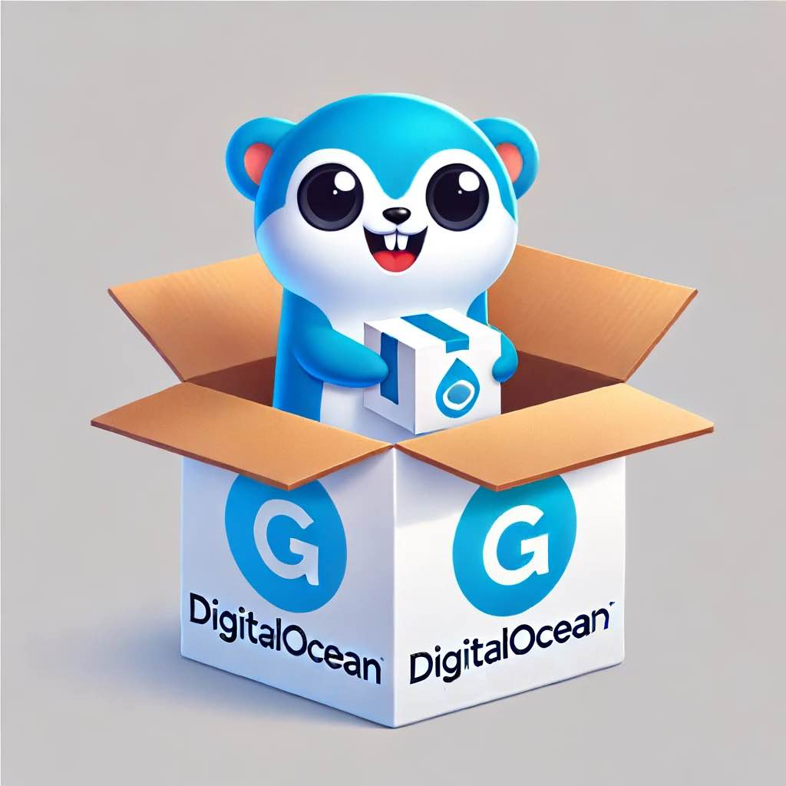

<div align="center">
<br/>
<br/>

<br/>
<br/>
</div>

# DoGo-Wrapper | DigitalOcean Go Serverless Wrapper


[](https://codecov.io/gh/darkrockmountain/digitalocean-go-wrapper)
[](LICENSE)
[](https://www.npmjs.com/package/digitalocean-go-wrapper)
[](https://www.npmjs.com/package/digitalocean-go-wrapper)
[](https://github.com/darkrockmountain/digitalocean-go-wrapper/releases)
[](https://scorecard.dev/viewer/?uri=github.com/darkrockmountain/digitalocean-go-wrapper)
[](https://goreportcard.com/report/github.com/darkrockmountain/digitalocean-go-wrapper)
[](https://app.fossa.com/projects/git%2Bgithub.com%2Fdarkrockmountain%2Fdigitalocean-go-wrapper?ref=badge_shield)
[](https://www.npmjs.com/package/digitalocean-go-wrapper)
[](https://www.npmjs.com/package/digitalocean-go-wrapper)
<!-- [](package.json) -->


DoGo-Wrapper is a Node.js package that simplifies deploying Go functions on DigitalOcean. It overcomes Go's limitations on DigitalOcean by building binaries locally using the latest version. Easily convert your Go projects into deployable Node.js packages and deploy them to DigitalOcean with minimal effort.

## Table of Contents

- [Prerequisites](#prerequisites)
- [Installation](#installation)
- [Usage](#usage)
- [Commands](#commands)
- [Deploying to DigitalOcean](#deploying-to-digitalocean)
- [License](#license)
- [Links](#links)

## Prerequisites

Before you begin, ensure you have met the following requirements:

- Node.js and npm are installed.
- Go is installed and configured.
- DigitalOcean CLI (optional, for deployment to DigitalOcean).

## Installation

To install the package globally via npm:

```bash
npm install -g digitalocean-go-wrapper
```

## Usage

To wrap a Go function and convert it into a Node.js package, use the following command:

```bash
dogo-wrap --do_go_dir <path_to_go_project> --do_project_output <output_directory> --files_to_keep '["file1.txt", "directory1/", "directory2/file_inside.txt"]'
```

For more options, use the `--help` command:
```bash
dogo-wrap --help
```
or
```bash
man dogo-wrap
```

### Command Line Arguments

- `--do_go_dir` or `-d`: Directory containing the Go files (default: `./`).
- `--do_project_output`, `--out` or `-o`: Output directory for the wrapped project (default: `./do_wrapped_function/`).
- `--files_to_keep`, `--ftk`: Array of files to keep in each of the function folders (default:` [".env"]`).

### Environment Variables

The following optional environment variables can be set to customize the function behavior:

- `START_DELIMITER`: Start delimiter for extracting JSON response (default: `<<<<<<<<<<<<<<<response<<<<<<<<<<<<<<<`).
- `END_DELIMITER`: End delimiter for extracting JSON response (default: `>>>>>>>>>>>>>>>response>>>>>>>>>>>>>>>`).


## Commands

### Build Go Project

The script will automatically initialize, tidy, and build the Go project. The built binary will be placed in the specified output directory.

### Convert to Node.js Package

The Go function is wrapped in a Node.js package using our tested DigitalOcean template. The necessary files and dependencies are copied and updated accordingly.

## Deploying to DigitalOcean

Once you have executed the `dogo-wrap` command and the project is wrapped, you can deploy your function to DigitalOcean with the following command:

```bash
doctl serverless deploy <output_directory>
```
## License

This project is licensed under the MIT License. See the [LICENSE](LICENSE) file for details.


[](https://app.fossa.com/projects/git%2Bgithub.com%2Fdarkrockmountain%2Fdigitalocean-go-wrapper?ref=badge_large)

## Links
- [Contributing](CONTRIBUTING.md)
- [Code of Conduct](CODE_OF_CONDUCT.md)

## Changelog

See the [CHANGELOG.md](CHANGELOG.md) file for details on updates and changes.
